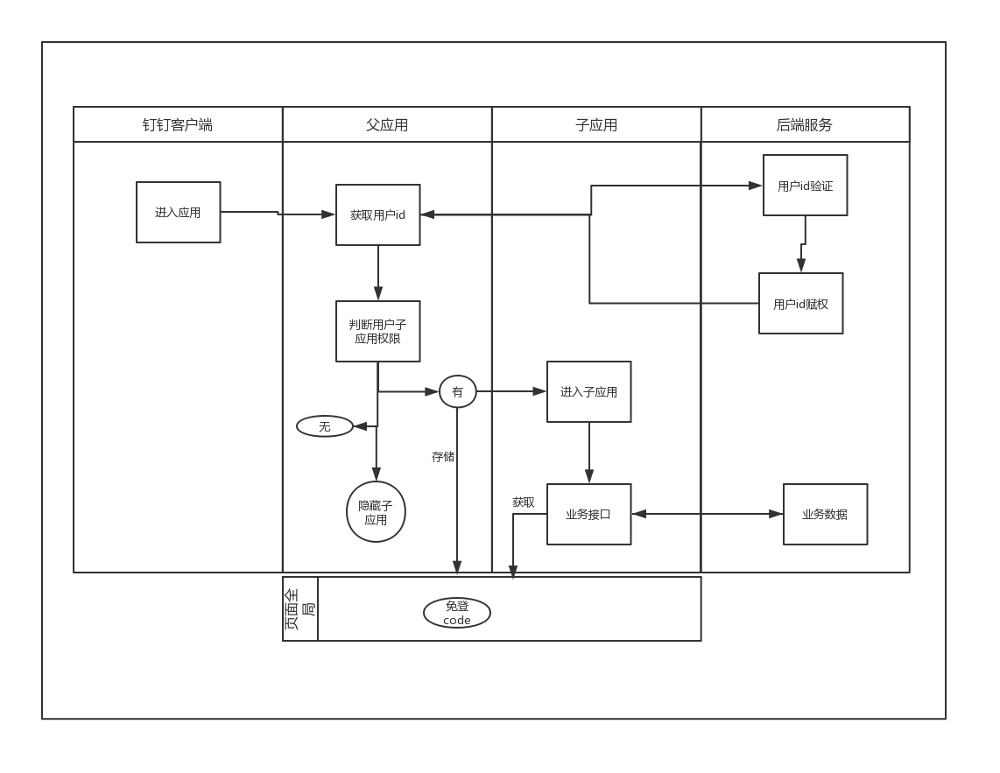

<!--
 * @Author: your name
 * @Date: 2019-12-16 10:30:23
 * @LastEditTime : 2019-12-24 13:34:48
 * @LastEditors  : Please set LastEditors
 * @Description: In User Settings Edit
 * @FilePath: \tiger-prawn-adfw\design.md
 -->
# 软件设计文档 

## 钉钉微应用

#### 1.1.1 技术选型及理由

**钉钉微应用**

   微应用即为单纯的网页，移动端webpage可以实现的功能都可以在微应用上呈现。
   ##### 优点：
   * 比小程序更小的开发难度，在桌面浏览器即可调试，更多的devtool，前端开发经验足够的情况下，debug更容易
   * 微应用开发IDE不限制。小程序要使用钉钉提供的IDE，功能弱稳定性差
   * 兼容性只需要顾及浏览器版本（钉钉微应用内部为chrome57版本），移动浏览器拥有的功能在开发时可以直接开展，不需要实验代码，小程序需要查阅文档的各个角落，还会有与文档描述不符合的地方和在开发工具和生产环境中表现不同的问题。
   * 有很多成熟的ui框架和组件（如下例quasar.js），在开发移动端应用和桌面应用时，无需在ui上过多浪费时间解决不同尺寸设备的显示效果。
   * 方便微前端架构开展。
   * 直接接入现有npm生态，npm包可以直接下载使用
   ##### 缺点：
   * 加载性能无法像小程序一样，将资源缓存在客户端本地，首屏开启速度略慢，具体取决与网络资源的下载。
   * 页面跳转回退做不到像小程序一样顺滑，体验比小程序略差
   * 钉钉api使用比小程序略麻烦，需要自己搞定加载过程，不能开箱即用。
   * 需要自己准备部署环境。小程序是直接上源代码到钉钉，钉钉进行编译部署发布。
   * 不支持灰度发布

**微前端**

我们在钉钉的微应用开发中引入了新的前端概念micro-frontend，即微前端概念，[这里](./microfronted.md)详细解释。

#### 1.1.3 钉钉api整合

   根据业务逻辑，需要在钉钉客户端进入父应用，在父应用获取钉钉免登录权限，存储到页面全局，与后端交互获取子应用访问权限，决定子应用是否可用。
   子应用之间可以自由切换，免登code存储在全局，不需要重复调用钉钉api。
   子应用与后端交互各自执行，父应用不接管。
   
   钉钉进入应用逻辑如下：

   

   > 后期如果有只需调用一次的钉钉api接口，建议如上图由父应用操作。

