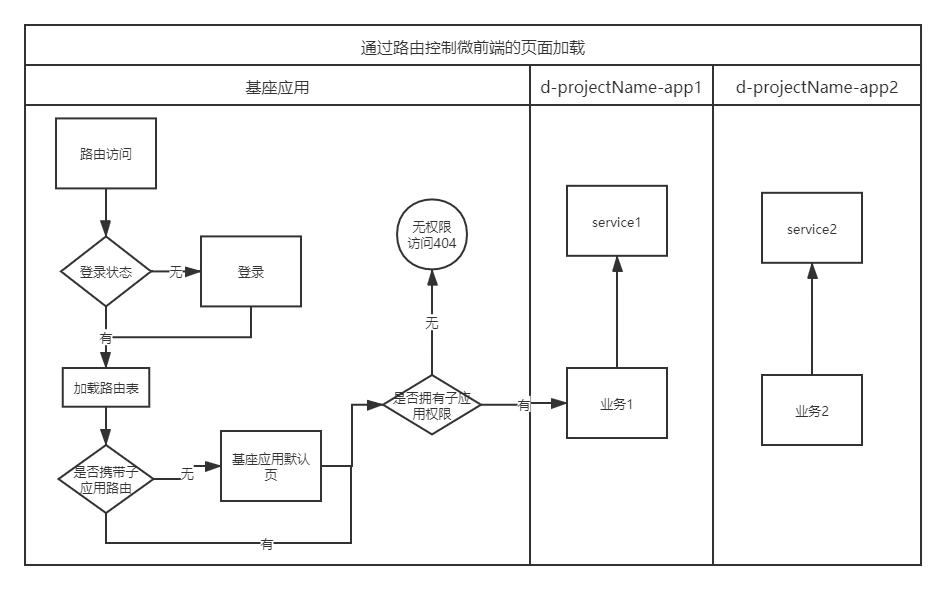

<!--
 * @Author: your name
 * @Date: 2019-12-23 17:22:22
 * @LastEditTime : 2019-12-24 13:35:07
 * @LastEditors  : Please set LastEditors
 * @Description: In User Settings Edit
 * @FilePath: \-\microfronted.md
 -->

# 为什么不选择iframe
1. url 不同步。浏览器刷新 iframe url 状态丢失、后退前进按钮无法使用。
2. UI 不同步，DOM 结构不共享。想象一下屏幕右下角 1/4 的 iframe 里来一个带遮罩层的弹框，同时我们要求这个弹框要浏览器居中显示，还要浏览器 resize 时自动居中..
3. 全局上下文完全隔离，内存变量不共享。iframe 内外系统的通信、数据同步等需求，主应用的 cookie 要透传到根域名都不同的子应用中实现免登效果。
4. 慢。每次子应用进入都是一次浏览器上下文重建、资源重新加载的过程。
其中有的问题比较好解决(问题1)，有的问题我们可以睁一只眼闭一只眼(问题4)，但有的问题我们则很难解决(问题3)甚至无法解决(问题2)，而这些无法解决的问题恰恰又会给产品带来非常严重的体验问题， 最终导致我们舍弃了 iframe 方案。

# 为什么需要微前端

   在应对控制台或者复合型应用的场景里，常见的开发思路有大概这几种
   * 单项目开发，优点是，心智成本低，开发方便实施。缺点是，耦合性强合作开发不方便，上线需要整体替换，容易牵一发而动全身。
   * 多应用开发（iframe），优点是，分离项目开发不用担心影响其他部分，各项目独立上线进度容易控制。缺点是，比如登陆状态等公用部分无法共享，开发到部署步骤繁琐需要在0-1的过程中浪费时间。
   喜闻乐见的iframe，iframe的优势，也是沙箱机制，在实现需要子应用和其他应用隔离时（防止变量污染，样式污染），iframe可以发挥大作用。所以多用于页面嵌入广告等场景。iframe 是一种比较古老的子应用开发模式，因为应用间有iframe的沙箱隔离机制，实现路由切分、共有样式、中心化权限管理等功能时，需要写大量胶水代码，资源重复利用困难。因为样式表被限制在子应用内部，所以实现响应式的布局很困难，天然不适合移动端的应用场景。
  
以上两种场景都是各有利弊，那有没有一种可以类似iframe可以实现多项目独立开发，又像普通spa一样方便好用的开发模式呢？
  > Techniques, strategies and recipes for building a modern web app with multiple teams that can ship features independently. -- Micro Frontends
微前端是一种多个团队通过独立发布功能的方式来共同构建现代化 web 应用的技术手段及方法策略。

微前端架构具备以下几个核心价值：

* 技术栈无关
主框架不限制接入应用的技术栈，子应用具备完全自主权

* 独立开发、独立部署
子应用仓库独立，前后端可独立开发，部署完成后主框架自动完成同步更新

* 增量升级
在面对各种复杂场景时，我们通常很难对一个已经存在的系统做全量的技术栈升级或重构，而微前端是一种非常好的实施渐进式重构的手段和策略

* 独立运行时
每个子应用之间状态隔离，运行时状态不共享

微前端架构旨在解决单体应用在一个相对长的时间跨度下，由于参与的人员、团队的增多、变迁，从一个普通应用演变成一个巨石应用(Frontend Monolith)后，随之而来的应用不可维护的问题。这类问题在企业级 Web 应用中尤其常见。

  # 微前端的选择
  
  single-spa框架 目前比较火的微前端框架，实现了微前端的几个主要构想，即
   * 独立部署：子应用和基座应用分离部署，运行时只需把子应用打包后的代码动态加载即可
   * 独立开发：子应用和基座应用是分离的应用，不需要在同一份源码里开发
   * 技术无关：子应用开发时只需完成必要的生命周期函数，无关使用何种前端mvvm框架，vue、react、jqury开发都可以接入
   * 不影响用户体验：对用户而言看到的是基座应用，所有功能只需要打开一个网页即可实现
   * url同步：直接访问子应用的路由，也是导向进入基座，再通过基座去加载静态资源。保证基座功能和浏览器的前进后退正常使用。
   
  qiankun是基于single-spa，同时比single-spa更易用，简单几步就可以将普通的单页应用扩展为基座或子应用。
  较常见的可以将逻辑的前置部分或者共有部分放置在基座应用上，业务开放放置在子应用上。即通过客户端访问【基座应用--路由加载-->子应用】的形式，实现分离开发、独立部署、局部更新、中心化权限管理。用户在使用中只需打开一个应用，即可获得所有功能。
  
微应用的示意图如下：

## 基座应用-子应用
 
所以我们需要一个单一的入口应用，然后应用内又足够的灵活，根据不同的用户，不同的需求去组装不同的业务应用。

### 中心化路由|路由拆分
微前端从本质上来说，是去中心化的，但是又不是完全的去中心化，对于一个微服务来说，它需要一个服务注册中心：

>服务提供方要注册通告服务地址，服务的调用方要能发现目标服务。

对于一个微前端应用来说，这个注册中心就是路由。

从页面上来说，只有我们在网页上添加一个菜单链接，用户才能知道某个页面是可以使用的。

而从代码上来说，那就是我们需要有一个地方来管理我们的应用：发现存在哪些应用，哪个应用使用哪个路由，从而实现通过路由直接到达应用。

我们可以在基座应用加载后，去动态的获取一个路由列表，这个列表可以被权限等后端逻辑控制，根据这个路由表去注册子应用。

### 标识应用

每个应用的名字通过{p|d}-{projectName}-{childName}表示,名字即表示了该应用的业务场景、部署位置、根路由信息，通过名字就可以很方便的引入子应用。

### 生命周期
Single-SPA 设计了一个基本的生命周期（虽然它没有统一管理），它包含了五种状态：

* load，决定加载哪个应用，并绑定生命周期
* bootstrap，获取静态资源
* mount，安装应用，如创建 DOM 节点
* unload，删除应用的生命周期
* unmount，卸载应用，如删除 DOM 节点

基座应用通过路由加载子应用后，就开始执行子应用的生命周期，所以只要公开了以上生命周期函数的应用，都可以作为子应用加载。
这降低了移植的开发成本，如果我需要整合一个已有项目进入基座应用体系，不需要考虑是何种框架开发的，只需要源代码中增加生命周期钩子，部署发布，基座应用添加路由即可。

### 独立部署和发布自动化

当我们开发一个新的组件，那么我们只需要更新我们的组件，并更新配置即可，配置更新后即在基座应用中发布成功了。

引入自动化测试部署的概念后，发布流程：

### 例子
以一个需要控制用户访问权限的后台管理网站为例：

当用户登陆时访问 http://baseUrl/childName ，
1. 首先进入基座应用进行登陆状态和鉴权判断，获取到用户的子应用访问权限后，
2. 基座开始根据权限注册子应用，如果用户想访问一个没有权限的子应用，该子应用并没有注册，只会访问到基座应用的前端404路由页面，并不会去拉去子应用的静态资源。
3. 基座拉取childName的子应用
4. 渲染子应用，进行子应用的业务

