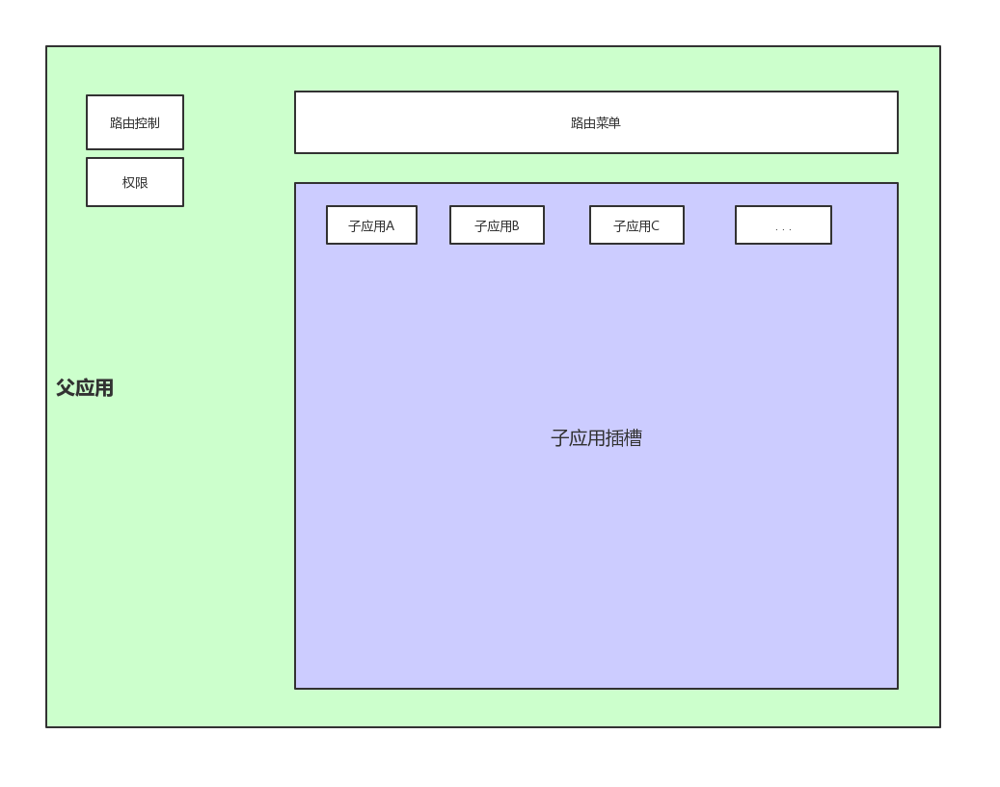
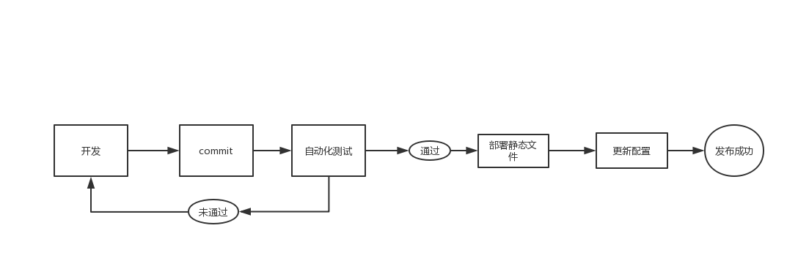

<!--
 * @Author: your name
 * @Date: 2019-12-23 17:22:22
 * @LastEditTime : 2019-12-24 13:35:07
 * @LastEditors  : Please set LastEditors
 * @Description: In User Settings Edit
 * @FilePath: \-\microfronted.md
 -->

# 微前端

   因需要开发多个应用，单项目开发耦合性强开发不方便，多应用上架部署困难，故选择qiankun(基于single-spa)可以将多项目整合同一个应用，通过客户端访问【父应用--->子应用】的形式，实现一次上架多个项目的目的。
   通过父应用-子应用的形式，可以实现，分离开发、独立部署、局部更新、中心化权限管理，用户在使用中只需接入和打开一个应用，即可获得所有功能。
   以此为基础选择了如下两种方案：

   1. iframe 是一种比较古老的子应用开发模式，因为应用间有iframe的沙箱隔离机制，实现路由切分、共有样式、中心化权限管理等功能时，需要写大量胶水代码，资源重复利用困难。因为样式表被限制在子应用内部，所以实现响应式的布局很困难，天然不适合移动端的应用场景。
   iframe的优势，也是沙箱机制，在实现需要子应用和其他应用隔离时（防止变量污染，样式污染），iframe可以发挥大作用。所以多用于页面嵌入广告等场景

   2. single-spa框架 目前比较火的微前端框架，实现了微前端的几个主要构想，即
   * 独立部署：子父应用分离部署，运行时只需把子应用打包后的代码动态加载即可
   * 独立开发：子应用和父应用是分离的应用，不需要在同一份源码里开发
   * 技术无关：子应用开发时只需完成必要的生命周期函数，无关使用何种前端mvvm框架，vue、react、jqury开发都可以接入
   * 不影响用户体验：对用户而言看到的是父应用，所有功能只需要打开一个网页即可实现

## 1. 设计思路
微应用的示意图如下：

### 父应用-子应用
需要开发多个应用，单项目开发耦合性强开发不方便，多应用上架部署困难。

所以我们需要一个单一的入口应用，然后应用内又足够的灵活，根据不同的用户，不同的需求去组装不同的业务应用。

我们通过【父应用--->子应用】的形式，去实现这种需求。

父应用，为应用的入口，不承载具体的业务需求，进行用户的鉴权，用户进入父应用后，根据权限决定哪些子应用可以使用，子应用作为父应用的一个菜单选项。如果有该子应用的权限，才能进入子应用。
子应用，可以拥有自己独立的路由管理，权限管理，独立的业务场景。在子应用开发完成后，在需要使用这种业务场景的情况下，只需要在父应用中注册就可以使用。
> 手机端和pc端父应用是单独两个，分开部署，作为钉钉微应用的手机端入口和pc端入口

### 中心化路由|路由拆分
微前端从本质上来说，是去中心化的，但是又不是完全的去中心化，对于一个微服务来说，它需要一个服务注册中心：

>服务提供方要注册通告服务地址，服务的调用方要能发现目标服务。

对于一个微前端应用来说，这个注册中心就是路由。

从页面上来说，只有我们在网页上添加一个菜单链接，用户才能知道某个页面是可以使用的。

而从代码上来说，那就是我们需要有一个地方来管理我们的应用：发现存在哪些应用，哪个应用使用哪个路由，从而实现通过路由直接到达应用。

### 标识应用

每个应用的名字通过{p|d}-{projectName}-{childName}表示,名字即表示了该应用的业务场景、部署位置、根路由信息，通过名字就可以很方便的引入子应用。

### 生命周期
Single-SPA 设计了一个基本的生命周期（虽然它没有统一管理），它包含了五种状态：

* load，决定加载哪个应用，并绑定生命周期
* bootstrap，获取静态资源
* mount，安装应用，如创建 DOM 节点
* unload，删除应用的生命周期
* unmount，卸载应用，如删除 DOM 节点

父应用通过路由加载子应用后，就开始执行子应用的生命周期，所以只要公开了以上生命周期函数的应用，都可以作为子应用加载。
这降低了移植的开发成本，如果我需要整合一个已有项目进入父应用体系，不需要考虑是何种框架开发的，只需要源代码中增加生命周期钩子，部署发布，父应用使用即可。

### 独立部署和发布自动化

当我们开发一个新的组件，那么我们只需要更新我们的组件，并更新配置即可，配置更新后即在父应用中发布成功了。

引入自动化测试部署的概念后，发布流程：

## 1.1.3 库 
**qiankun**

   qiankun是基于single-spa的封装，开发更易用，不改变single-spa逻辑。

**vue.js**

   父应用和子应用mvvm框架均可使用vue.js，和现有技术栈兼容，在进行子应用的移植时，需要进行以下几步：
   * 在入口文件加入生命周期
   * 调整子应用路由根路径
   * webpack配置更新为umd模式

